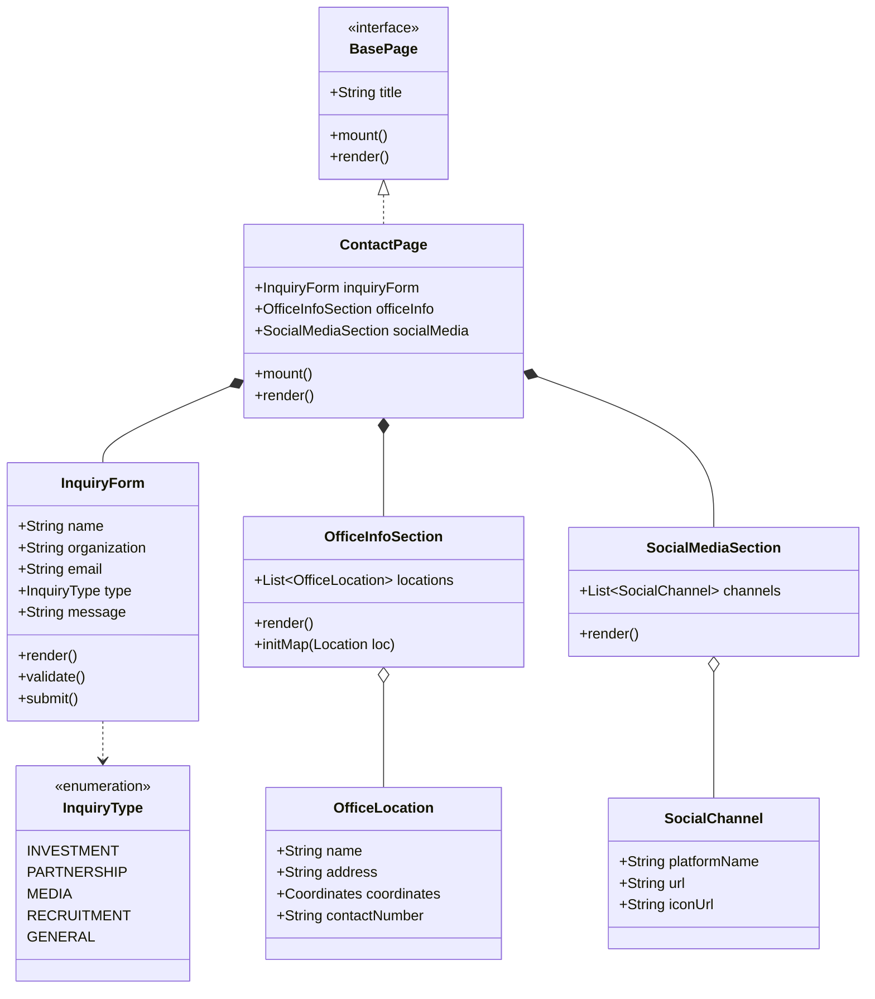

# Contact Page Class Diagram

```mermaid
classDiagram
    class BasePage {
        <<interface>>
        +String title
        +mount()
        +render()
    }

    class ContactPage {
        +InquiryForm inquiryForm
        +OfficeInfoSection officeInfo
        +SocialMediaSection socialMedia
        +mount()
        +render()
    }

    BasePage <|.. ContactPage

    class InquiryForm {
        +String name
        +String organization
        +String email
        +InquiryType type
        +String message
        +render()
        +validate()
        +submit()
    }

    class OfficeInfoSection {
        +List~OfficeLocation~ locations
        +render()
        +initMap(Location loc)
    }

    class SocialMediaSection {
        +List~SocialChannel~ channels
        +render()
    }

    %% Models
    class OfficeLocation {
        +String name
        +String address
        +Coordinates coordinates
        +String contactNumber
    }

    class SocialChannel {
        +String platformName
        +String url
        +String iconUrl
    }

    class InquiryType {
        <<enumeration>>
        INVESTMENT
        PARTNERSHIP
        MEDIA
        RECRUITMENT
        GENERAL
    }

    %% Relationships
    ContactPage *-- InquiryForm
    ContactPage *-- OfficeInfoSection
    ContactPage *-- SocialMediaSection

    InquiryForm ..> InquiryType
    OfficeInfoSection o-- OfficeLocation
    SocialMediaSection o-- SocialChannel
```
