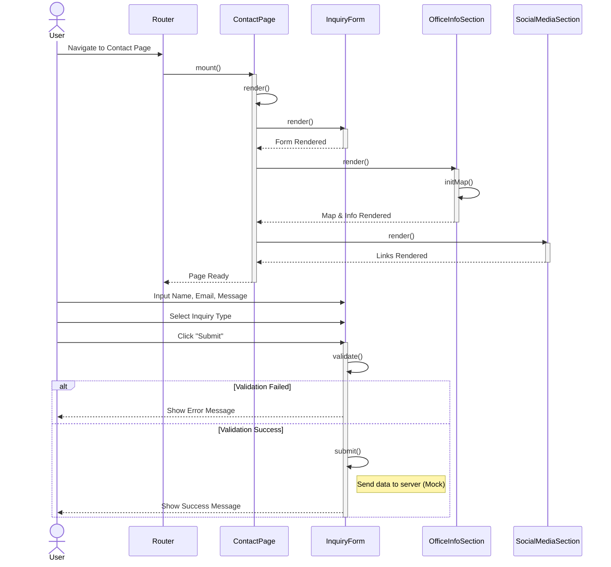

# Contact Page Sequence Diagram

```mermaid
sequenceDiagram
    actor User
    participant Router
    participant Page as ContactPage
    participant Form as InquiryForm
    participant Office as OfficeInfoSection
    participant Social as SocialMediaSection

    %% 1. Page Lifecycle: Mount & Render
    User->>Router: Navigate to Contact Page
    Router->>Page: mount()
    activate Page
    
    Page->>Page: render()

    %% 1.1 Render Components
    Page->>Form: render()
    activate Form
    Form-->>Page: Form Rendered
    deactivate Form

    Page->>Office: render()
    activate Office
    Office->>Office: initMap()
    Office-->>Page: Map & Info Rendered
    deactivate Office

    Page->>Social: render()
    activate Social
    Social-->>Page: Links Rendered
    deactivate Social

    Page-->>Router: Page Ready
    deactivate Page

    %% 2. Form Submission Flow
    User->>Form: Input Name, Email, Message
    User->>Form: Select Inquiry Type
    User->>Form: Click "Submit"
    activate Form
    
    Form->>Form: validate()
    alt Validation Failed
        Form-->>User: Show Error Message
    else Validation Success
        Form->>Form: submit()
        Note right of Form: Send data to server (Mock)
        Form-->>User: Show Success Message
    end
    deactivate Form
```
