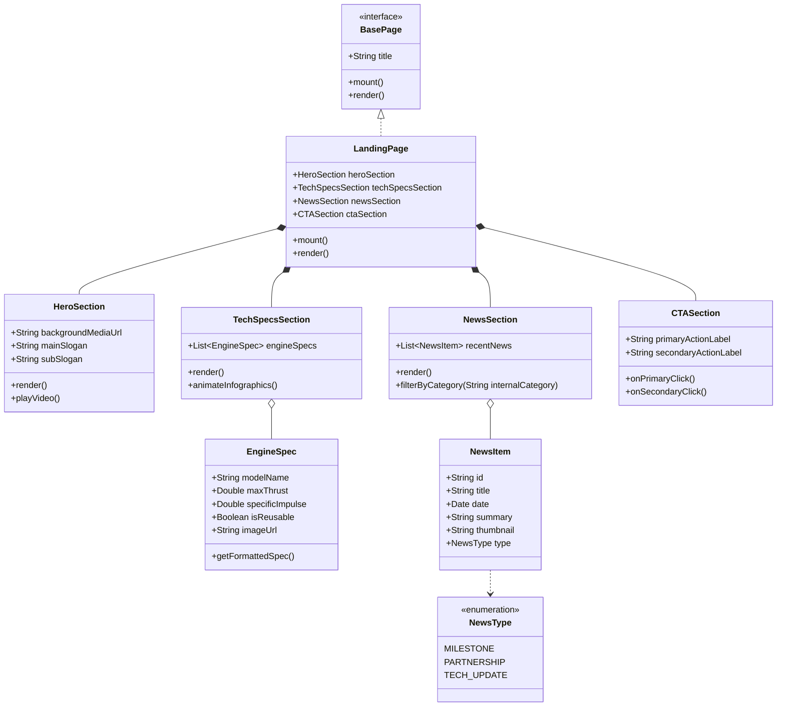

# Landing Page Class Diagram

```mermaid
classDiagram
    %% 1. Page & Layout Components
    class BasePage {
        <<interface>>
        +String title
        +mount()
        +render()
    }

    class LandingPage {
        +HeroSection heroSection
        +TechSpecsSection techSpecsSection
        +NewsSection newsSection
        +CTASection ctaSection
        +mount()
        +render()
    }

    BasePage <|.. LandingPage

    class HeroSection {
        +String backgroundMediaUrl
        +String mainSlogan
        +String subSlogan
        +render()
        +playVideo()
    }

    class TechSpecsSection {
        +List~EngineSpec~ engineSpecs
        +render()
        +animateInfographics()
    }

    class NewsSection {
        +List~NewsItem~ recentNews
        +render()
        +filterByCategory(String internalCategory)
    }

    class CTASection {
        +String primaryActionLabel
        +String secondaryActionLabel
        +onPrimaryClick()
        +onSecondaryClick()
    }

    %% 2. Data Models
    class EngineSpec {
        +String modelName
        +Double maxThrust
        +Double specificImpulse
        +Boolean isReusable
        +String imageUrl
        +getFormattedSpec()
    }

    class NewsItem {
        +String id
        +String title
        +Date date
        +String summary
        +String thumbnail
        +NewsType type
    }
    
    class NewsType {
        <<enumeration>>
        MILESTONE
        PARTNERSHIP
        TECH_UPDATE
    }

    %% 3. Relationships
    LandingPage *-- HeroSection
    LandingPage *-- TechSpecsSection
    LandingPage *-- NewsSection
    LandingPage *-- CTASection

    TechSpecsSection o-- EngineSpec
    NewsSection o-- NewsItem
    NewsItem ..> NewsType
```
