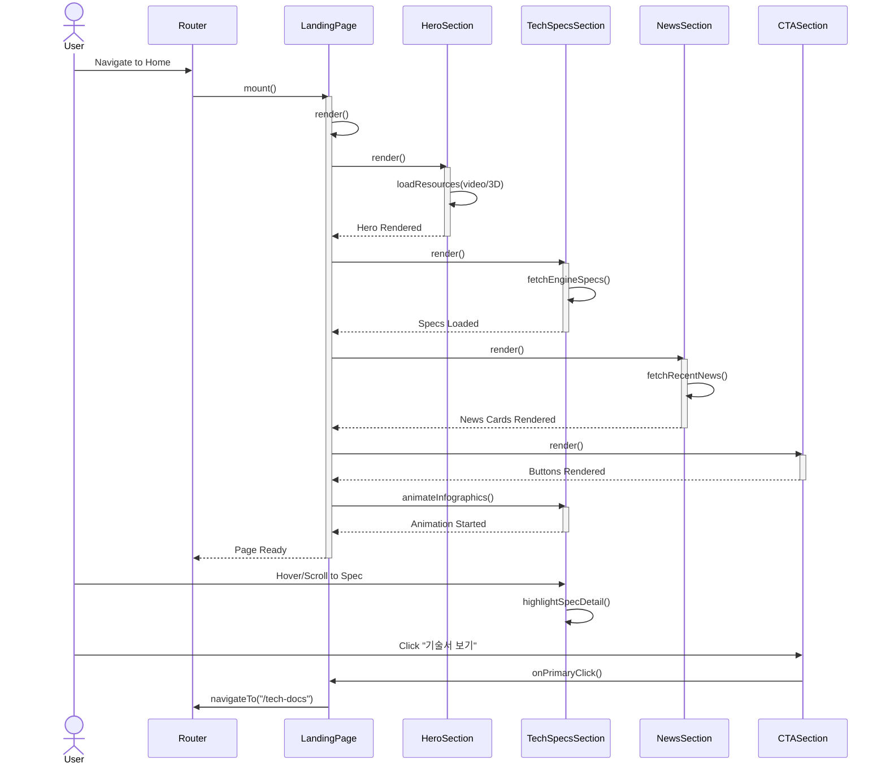

# Landing Page Sequence Diagram

```mermaid
sequenceDiagram
    actor User
    participant Router
    participant Page as LandingPage
    participant Hero as HeroSection
    participant Tech as TechSpecsSection
    participant News as NewsSection
    participant CTA as CTASection

    %% 1. Page Lifecycle: Mount & Render
    User->>Router: Navigate to Home
    Router->>Page: mount()
    activate Page
    
    Page->>Page: render()
    
    %% 1.1 Hero Section
    Page->>Hero: render()
    activate Hero
    Hero->>Hero: loadResources(video/3D)
    Hero-->>Page: Hero Rendered
    deactivate Hero

    %% 1.2 Tech Specs
    Page->>Tech: render()
    activate Tech
    Tech->>Tech: fetchEngineSpecs()
    Tech-->>Page: Specs Loaded
    deactivate Tech

    %% 1.3 News Section
    Page->>News: render()
    activate News
    News->>News: fetchRecentNews()
    News-->>Page: News Cards Rendered
    deactivate News

    %% 1.4 CTA Section
    Page->>CTA: render()
    activate CTA
    CTA-->>Page: Buttons Rendered
    deactivate CTA

    %% 1.5 Post-Render Animations
    Page->>Tech: animateInfographics()
    activate Tech
    Tech-->>Page: Animation Started
    deactivate Tech

    Page-->>Router: Page Ready
    deactivate Page

    %% 2. User Interactions
    
    %% 2.1 Viewing Specs
    User->>Tech: Hover/Scroll to Spec
    Tech->>Tech: highlightSpecDetail()

    %% 2.2 Clicking CTA
    User->>CTA: Click "기술서 보기"
    CTA->>Page: onPrimaryClick()
    Page->>Router: navigateTo("/tech-docs")
```
