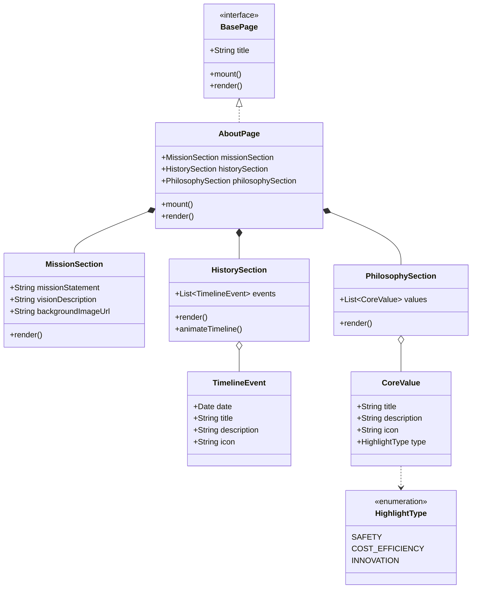

# About Us Page Class Diagram

```mermaid
classDiagram
    %% Page & Sections
    class BasePage {
        <<interface>>
        +String title
        +mount()
        +render()
    }

    class AboutPage {
        +MissionSection missionSection
        +HistorySection historySection
        +PhilosophySection philosophySection
        +mount()
        +render()
    }

    BasePage <|.. AboutPage

    class MissionSection {
        +String missionStatement
        +String visionDescription
        +String backgroundImageUrl
        +render()
    }

    class HistorySection {
        +List~TimelineEvent~ events
        +render()
        +animateTimeline()
    }

    class PhilosophySection {
        +List~CoreValue~ values
        +render()
    }

    %% Data Models
    class TimelineEvent {
        +Date date
        +String title
        +String description
        +String icon
    }

    class CoreValue {
        +String title
        +String description
        +String icon
        +HighlightType type
    }
    
    class HighlightType {
        <<enumeration>>
        SAFETY
        COST_EFFICIENCY
        INNOVATION
    }

    %% Relationships
    AboutPage *-- MissionSection
    AboutPage *-- HistorySection
    AboutPage *-- PhilosophySection

    HistorySection o-- TimelineEvent
    PhilosophySection o-- CoreValue
    CoreValue ..> HighlightType
```
