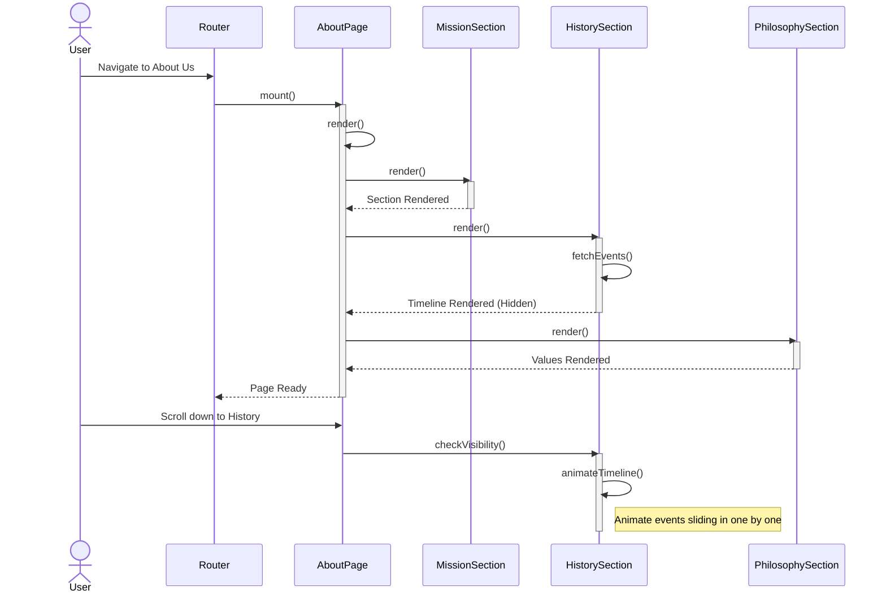

# About Us Page Sequence Diagram

```mermaid
sequenceDiagram
    actor User
    participant Router
    participant Page as AboutPage
    participant Mission as MissionSection
    participant History as HistorySection
    participant Philosophy as PhilosophySection

    %% 1. Page Lifecycle: Mount & Render
    User->>Router: Navigate to About Us
    Router->>Page: mount()
    activate Page
    
    Page->>Page: render()

    %% 1.1 Render Mission Section
    Page->>Mission: render()
    activate Mission
    Mission-->>Page: Section Rendered
    deactivate Mission

    %% 1.2 Render History Section
    Page->>History: render()
    activate History
    History->>History: fetchEvents()
    History-->>Page: Timeline Rendered (Hidden)
    deactivate History

    %% 1.3 Render Philosophy Section
    Page->>Philosophy: render()
    activate Philosophy
    Philosophy-->>Page: Values Rendered
    deactivate Philosophy

    Page-->>Router: Page Ready
    deactivate Page

    %% 2. User Interactions (Scroll)
    
    User->>Page: Scroll down to History
    Page->>History: checkVisibility()
    activate History
    History->>History: animateTimeline()
    Note right of History: Animate events sliding in one by one
    deactivate History
```
