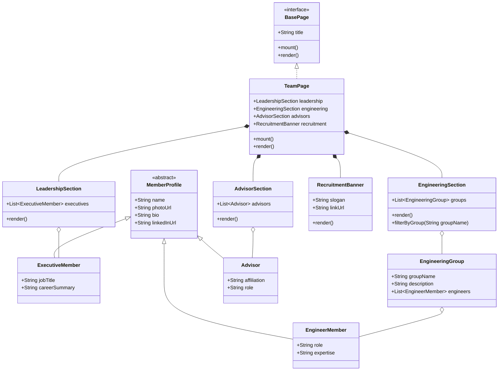

# Team Member Page Class Diagram

```mermaid
classDiagram
    class BasePage {
        <<interface>>
        +String title
        +mount()
        +render()
    }

    class TeamPage {
        +LeadershipSection leadership
        +EngineeringSection engineering
        +AdvisorSection advisors
        +RecruitmentBanner recruitment
        +mount()
        +render()
    }

    BasePage <|.. TeamPage

    class LeadershipSection {
        +List~ExecutiveMember~ executives
        +render()
    }

    class EngineeringSection {
        +List~EngineeringGroup~ groups
        +render()
        +filterByGroup(String groupName)
    }

    class AdvisorSection {
        +List~Advisor~ advisors
        +render()
    }

    class RecruitmentBanner {
        +String slogan
        +String linkUrl
        +render()
    }

    %% Models
    class MemberProfile {
        <<abstract>>
        +String name
        +String photoUrl
        +String bio
        +String linkedInUrl
    }

    class ExecutiveMember {
        +String jobTitle
        +String careerSummary
    }

    class EngineeringGroup {
        +String groupName
        +String description
        +List~EngineerMember~ engineers
    }

    class EngineerMember {
        +String role
        +String expertise
    }

    class Advisor {
        +String affiliation
        +String role
    }

    %% Inheritance & Relations
    MemberProfile <|-- ExecutiveMember
    MemberProfile <|-- EngineerMember
    MemberProfile <|-- Advisor

    TeamPage *-- LeadershipSection
    TeamPage *-- EngineeringSection
    TeamPage *-- AdvisorSection
    TeamPage *-- RecruitmentBanner

    LeadershipSection o-- ExecutiveMember
    EngineeringSection o-- EngineeringGroup
    EngineeringGroup o-- EngineerMember
    AdvisorSection o-- Advisor
```
