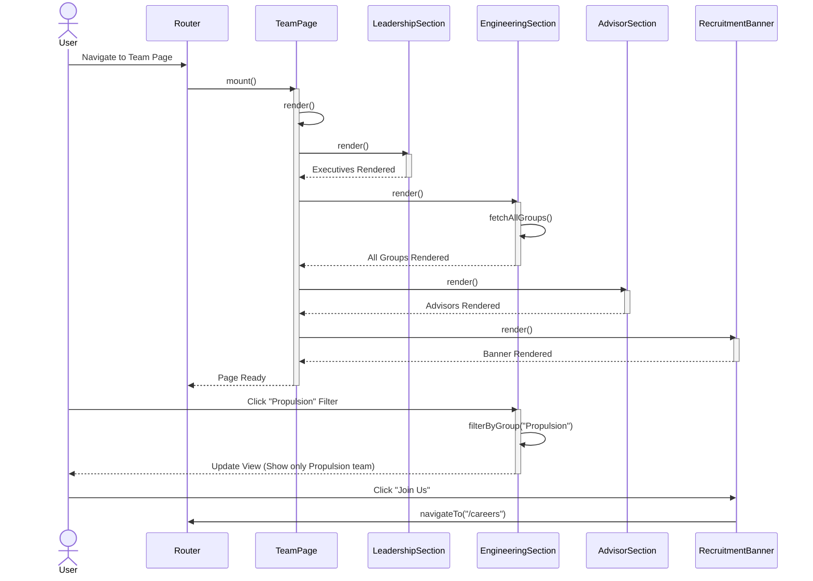

# Team Member Page Sequence Diagram

```mermaid
sequenceDiagram
    actor User
    participant Router
    participant Page as TeamPage
    participant Leadership as LeadershipSection
    participant Engineering as EngineeringSection
    participant Advisor as AdvisorSection
    participant Recruit as RecruitmentBanner

    %% 1. Page Lifecycle: Mount & Render
    User->>Router: Navigate to Team Page
    Router->>Page: mount()
    activate Page
    
    Page->>Page: render()

    %% 1.1 Render Leadership
    Page->>Leadership: render()
    activate Leadership
    Leadership-->>Page: Executives Rendered
    deactivate Leadership

    %% 1.2 Render Engineering
    Page->>Engineering: render()
    activate Engineering
    Engineering->>Engineering: fetchAllGroups()
    Engineering-->>Page: All Groups Rendered
    deactivate Engineering

    %% 1.3 Render Advisors
    Page->>Advisor: render()
    activate Advisor
    Advisor-->>Page: Advisors Rendered
    deactivate Advisor

    %% 1.4 Render Recruitment
    Page->>Recruit: render()
    activate Recruit
    Recruit-->>Page: Banner Rendered
    deactivate Recruit
    
    Page-->>Router: Page Ready
    deactivate Page

    %% 2. Interactions
    
    %% 2.1 Filter Engineering Logic
    User->>Engineering: Click "Propulsion" Filter
    activate Engineering
    Engineering->>Engineering: filterByGroup("Propulsion")
    Engineering-->>User: Update View (Show only Propulsion team)
    deactivate Engineering

    %% 2.2 Recruitment Click
    User->>Recruit: Click "Join Us"
    Recruit->>Router: navigateTo("/careers")
```
