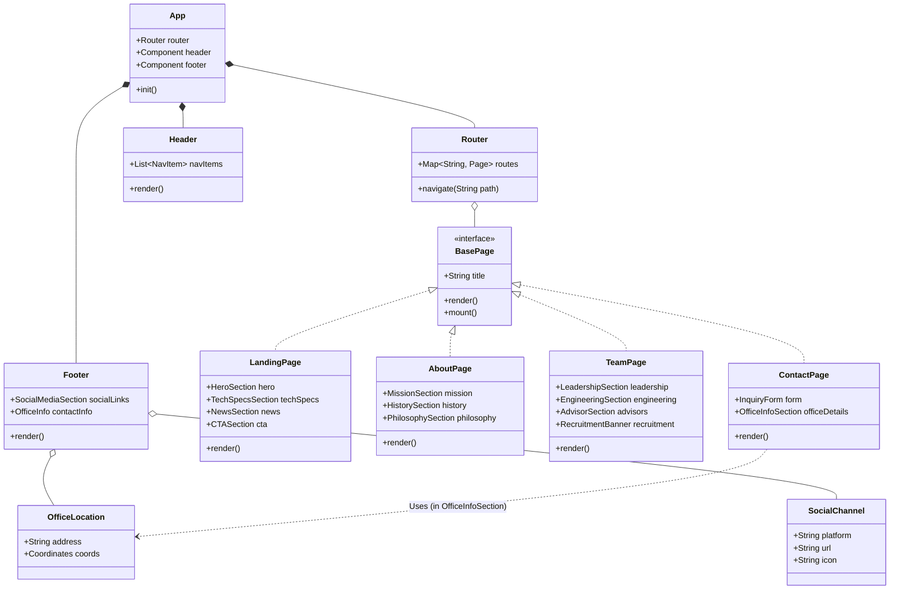

# Unified Website Architecture Class Diagram

```mermaid
classDiagram
    %% Core Architecture (SPA Pattern)
    class App {
        +Router router
        +Component header
        +Component footer
        +init()
    }

    class Router {
        +Map~String, Page~ routes
        +navigate(String path)
    }

    class BasePage {
        <<interface>>
        +String title
        +render()
        +mount()
    }

    %% Common UI Components
    class Header {
        +List~NavItem~ navItems
        +render()
    }

    class Footer {
        +SocialMediaSection socialLinks
        +OfficeInfo contactInfo
        +render()
    }

    %% Concrete Pages
    class LandingPage {
        +HeroSection hero
        +TechSpecsSection techSpecs
        +NewsSection news
        +CTASection cta
        +render()
    }

    class AboutPage {
        +MissionSection mission
        +HistorySection history
        +PhilosophySection philosophy
        +render()
    }

    class TeamPage {
        +LeadershipSection leadership
        +EngineeringSection engineering
        +AdvisorSection advisors
        +RecruitmentBanner recruitment
        +render()
    }

    class ContactPage {
        +InquiryForm form
        +OfficeInfoSection officeDetails
        +render()
    }

    %% Shared Data Classes (DTOs)
    class SocialChannel {
        +String platform
        +String url
        +String icon
    }

    class OfficeLocation {
        +String address
        +Coordinates coords
    }

    %% Inheritance Relationships
    BasePage <|.. LandingPage
    BasePage <|.. AboutPage
    BasePage <|.. TeamPage
    BasePage <|.. ContactPage

    App *-- Router
    App *-- Header
    App *-- Footer
    
    Router o-- BasePage

    %% Data Reuse
    Footer o-- SocialChannel
    Footer o-- OfficeLocation
    ContactPage ..> OfficeLocation : Uses (in OfficeInfoSection)
```
