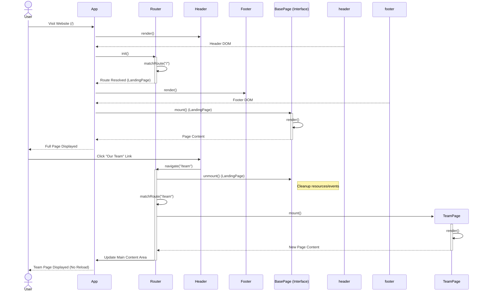

# Unified SPA Sequence Diagram

```mermaid
sequenceDiagram
    actor User
    participant App
    participant Router
    participant Header
    participant Footer
    participant CurrentPage as BasePage (Interface)

    %% 1. Application Initialization
    User->>App: Visit Website (/)
    activate App
    App->>Header: render()
    header-->>App: Header DOM
    
    App->>Router: init()
    activate Router
    Router->>Router: matchRoute("/")
    Router-->>App: Route Resolved (LandingPage)
    deactivate Router

    App->>Footer: render()
    footer-->>App: Footer DOM
    
    %% 2. Page Mounting
    App->>CurrentPage: mount() (LandingPage)
    activate CurrentPage
    CurrentPage->>CurrentPage: render()
    CurrentPage-->>App: Page Content
    deactivate CurrentPage
    
    App-->>User: Full Page Displayed

    %% 3. Navigation Event (SPA Routing)
    User->>Header: Click "Our Team" Link
    Header->>Router: navigate("/team")
    activate Router
    
    Router->>CurrentPage: unmount() (LandingPage)
    Note right of CurrentPage: Cleanup resources/events
    
    Router->>Router: matchRoute("/team")
    create participant NewPage as TeamPage
    Router->>NewPage: mount()
    activate NewPage
    NewPage->>NewPage: render()
    NewPage-->>Router: New Page Content
    deactivate NewPage
    
    Router->>App: Update Main Content Area
    deactivate Router
    
    App-->>User: Team Page Displayed (No Reload)
```
